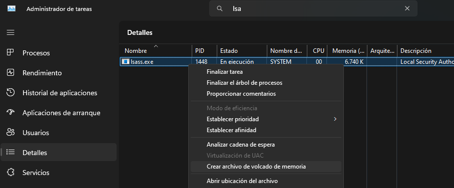
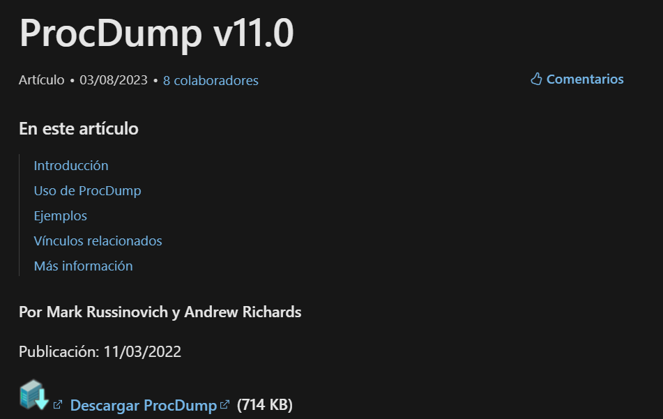

# Volcado de memoria Windows

## 1º Entorno gráfico

Haciendo uso del administrador de tareas (en modo admin), buscando el proceso `lsas.exe` en el apartado de `datails`:

<figure><figcaption></figcaption></figure>

Una vez una vez generado el archivo se puede analizar con Mimikatz.

## 2º Procdump de Windows



Descargamos el Binario

<figure><figcaption></figcaption></figure>

Desde cmd como administrador nos metemos en la carpeta que hemos descargado y ejecutamos el `procdump64.exe`:

```bash
procdump64.exe -accepteula -ma lsass.exe lsass.dmp
```

Es probable que el antivirus de Windows Defender bloquee el volcado de memoria.
